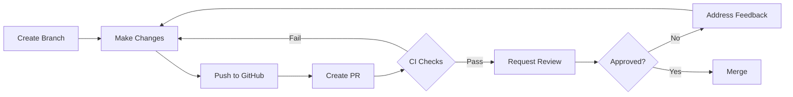

# Contributing Guidelines

## Branch Protection

Our `main` branch is protected with the following rules:

### Requirements for Merging

1. **Pull Request Required**
   - Direct pushes to `main` are forbidden
   - All changes must go through a PR

2. **Code Review**
   - Minimum 1 approval required
   - CODEOWNERS must approve relevant changes
   - Stale approvals are dismissed on new commits

3. **Status Checks**
   - All CI checks must pass
   - Branch must be up-to-date with main

4. **Linear History**
   - Merge commits are not allowed
   - Use "Squash and Merge" or "Rebase and Merge"

5. **Conversations**
   - All review comments must be resolved

### Workflow

## Tips

    - Keep PRs small and focused
    - Write descriptive commit messages
    - Respond to review comments promptly
    - Keep your branch up-to-date with main

